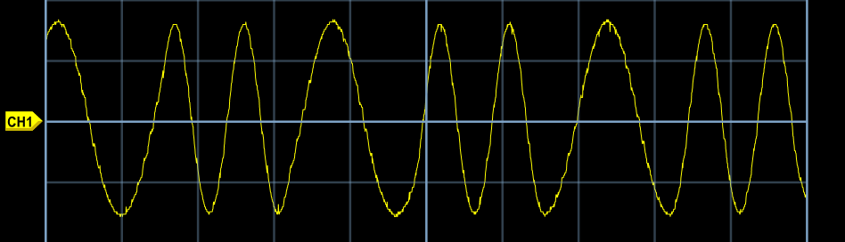
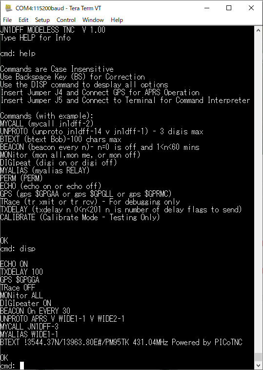
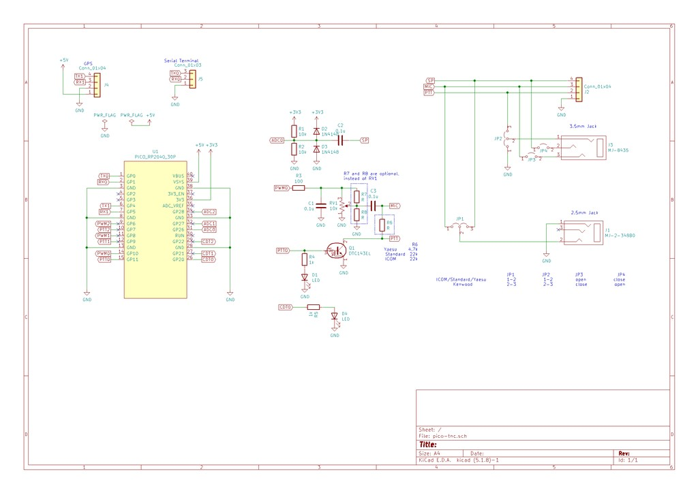

# PICO TNC D+

[日本語版](/README_JP.md)

Daisuke JA1UMW / CQAKIBA.TOKYO Ver.

[Original PICO-TNC](https://github.com/amedes/pico_tnc)

[Introduction](/INTRODUCTION_JP.md)

PICO TNC is the Terminal Node Controler for Amateur Packet Radio powered by Raspberry Pi Pico.

This TNC has same functionality as WB8WGA's PIC TNC.

## PIC TNC features

- Encode and decode Bell 202 AFSK signal without modem chip
- Digipeat UI packet up to 1024 byte length
- Send beacon packet
- Support converse mode
- Support GPS tracker feature
- Support both USB serial and UART serial interface

## Additional features

- Support KISS mode
- Support multi-port up to 3 ports
- On-air self-contained electronic QSL system
- Built-in MonaCoin-compatible digital signature algorithm (Elliptic Curve Cryptography 256-bit)

## Help command

- `help` : English help
- `help ja` / `help ja sjis` : Japanese help in Shift_JIS
- `help ja utf8` : Japanese help in UTF-8
- If `MYCALL` or `UNPROTO` is unset, help shows a warning message to set both values.
- `txdelay n|nms|ns` : TX delay (`0..1000ms`, unitless `n` keeps legacy `10ms` units)
- `axdelay n|nms|ns` : AX.25 preamble delay (`0..1000ms`, unitless `n` keeps legacy `10ms` units)
- `axhang n|nms|ns` : hold PTT after frame end (`0..1000ms`, unitless `n` keeps legacy `10ms` units)
- `about` : version information and third-party component references
- `privkey show` : display persisted key material after interactive security confirmation
- `privkey gen [m|p|mona1|p2pkh|p2sh|p2wpkh]` : generate Monacoin private key, display derived addresses, and allow `Space` respin (`Enter` accepts in RAM; use `perm` to persist into Flash)
- `privkey set [m|p|mona1|p2pkh|p2sh|p2wpkh|WIF|RAW]` : set active address type only (`m/p/mona1/...`) or import/store private key (`WIF/RAW`); typed WIF updates active type, untyped WIF/RAW keeps current type
- `sign msg <text>` : sign `{"FR":"<MYCALL>","MSG":"<text>"}` and append base64 signature, then prepare AX.25 UI-frame TX with Enter/ESC confirmation
- `sign adv -name <name> -bio <bio>` : sign `{"FR":"<MYCALL>","ADV":{"N":"<name>","B":"<bio>","A":"<active_address>"}}` and append base64 signature, then prepare AX.25 UI-frame TX with Enter/ESC confirmation
- `sign qsl ...` : sign QSL JSON payload (`{"FR":"<MYCALL>","QSL":{"C","S","D","T","F","M","P"}}`) and prepare AX.25 UI-frame TX; supports argument form and no-arg wizard form (each option value may include spaces and is read until the next `-option`)
- `sign recovery {JSON}<signature>` : inject a manually typed signed payload into the same signature-recovery path used for received packets (for debugging receive-side behavior)
- `system usb_bootloader` : guarded reboot to USB BOOTSEL mode (requires `Y`, `E`, `S`, `Enter` in order within 10 seconds)
- `termtest` : raw terminal inspection mode; prints received bytes in hex/labels and exits on `Ctrl+C`

## Command-line editing and history

- Input line buffer: `1024` bytes (extra input beyond 1024 bytes is truncated at the tail).
- History buffer: `8` entries × `1024` bytes.
- ANSI escape sequence keys:
  - `↑ / ↓`: history previous/next
  - `← / →`: move cursor left/right
  - `Home / End`: move to line start/end
  - `Backspace / Delete`: edit inside the line
- Fallback control keys for non-ANSI terminals:
  - `Ctrl+P / Ctrl+N`: history previous/next
  - `Ctrl+B / Ctrl+F`: cursor left/right
  - `Ctrl+A / Ctrl+E`: line start/end
  - `Ctrl+H`: backspace

## How to build

```
git clone https://github.com/amedes/pico_tnc.git
cd pico_tnc
mkdir build
cd build
cmake ..
make -j4
(flash 'pico_tnc/pico_tnc.uf2' file to your Pico)
```


[](schematic.png)
